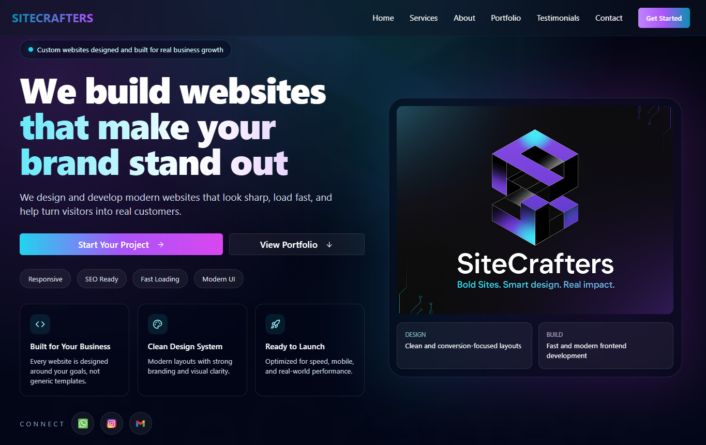

# 🚀 Welcome to SiteCrafters

  
  

---

## 🌐 Live Website

👉 https://sitecraftersltd.com/

---

## 📌 About SiteCrafters

**SiteCrafters** is a modern web development studio focused on building high-performance, visually refined, and conversion-driven websites.

We specialize in creating digital experiences that help businesses establish a strong online presence, improve credibility, and convert visitors into customers.

Our focus is on:

- Clean, modern UI/UX design
- Fast and responsive web applications
- SEO-optimized structure
- Scalable and maintainable frontend systems
- Business-focused digital solutions

We aim to combine **design precision + technical performance + business strategy** into every project we build.

---

## 🧩 About This Project

This is the official **SiteCrafters marketing website**, built to showcase:

- Our services
- Portfolio of completed work
- Client testimonials
- Company identity and branding
- Contact and lead generation system

It is designed as a **fully responsive, production-grade agency website** with a focus on performance, accessibility, and modern UI patterns.

---

## ⚙️ Technologies Used

- ⚡ Vite
- 🟦 TypeScript
- ⚛️ React
- 🎨 Tailwind CSS
- 🧩 shadcn/ui
- 🔥 React Router
- 🧠 React Hook Form
- 🗄️ Supabase

---

## 🚀 Features

- Fully responsive design (mobile → desktop)
- Smooth routing with React Router
- Dynamic portfolio system (JSON-driven projects)
- Testimonial submission + database integration
- SEO optimized pages (meta + Open Graph)
- Modern animated UI sections
- Reusable component structure
- Performance-focused architecture

---

## 🌍 Deployment

The project is deployed on **Netlify**:

👉 https://sitecraftersltd.com/

---

## 🧠 Purpose

This project serves as:

- A real-world agency showcase website
- A lead generation platform
- A portfolio of development capability
- A foundation for scaling future client projects

---

## 📍 Location

Crafted with 💻 + ❤️ in **Kigali, Rwanda**

---

## © License

© 2026 SiteCrafters. All rights reserved.
